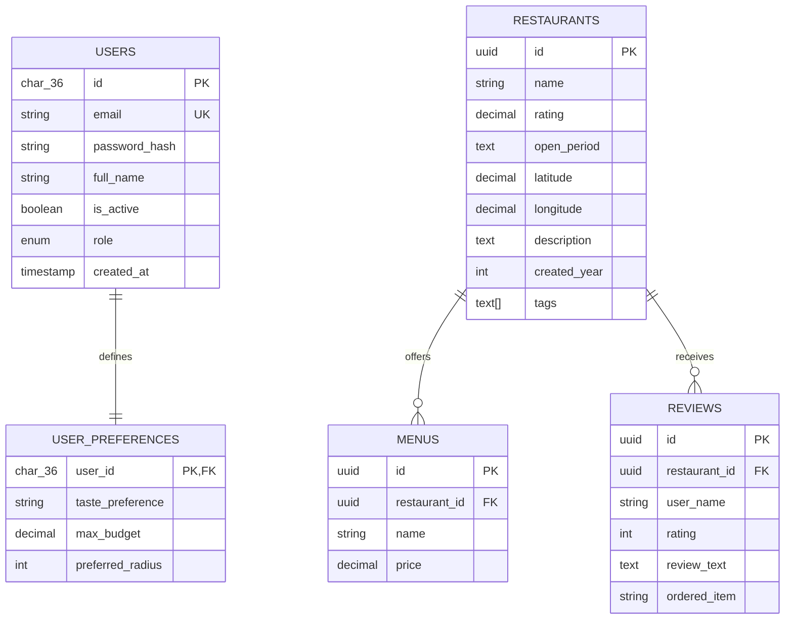

# Foodiction Database Schema Design

**Project:** Food Recommendation Web Application (Yogyakarta Culinary Heritage Platform)  
**Type:** University Capstone Project / Scalable Software Design Implementation  
**Target Architecture:** Microservices (Database-per-Service Model)  
**Engines:** MySQL 8.0+ (User Service) & PostgreSQL 14+ (Food Service)  

---

## Table of Contents
1. [Entity Relationship Diagram (ERD)](#1-entity-relationship-diagram-erd)
2. [User Service Database Schema (MySQL)](#2-user-service-database-schema-mysql)
3. [Food & Discovery Service Database Schema (PostgreSQL)](#3-food--discovery-service-database-schema-postgresql)
4. [Data Dictionary & Constraints](#4-data-dictionary--constraints)
5. [Query Optimization & Indexing Strategy](#5-query-optimization--indexing-strategy)
6. [Data Integrity: Database Aggregation Triggers](#6-data-integrity-database-aggregation-triggers)

---

## 1. Entity Relationship Diagram (ERD)

The system enforces isolation between the **User Domain** and the **Food Domain** to align with stateless microservices practices. The connection between services is federated via the unique User UUID.



---

## 2. User Service Database Schema (MySQL)

This database manages user credentials, authentication lifecycles, and high-level personal preference configurations. It uses the `InnoDB` storage engine to guarantee ACID compliance.

```sql
CREATE DATABASE IF NOT EXISTS foodiction_user_db;
USE foodiction_user_db;

-- 1. Core Users Table
CREATE TABLE users (
    id CHAR(36) NOT NULL,
    email VARCHAR(255) NOT NULL,
    password_hash VARCHAR(255) NOT NULL,
    full_name VARCHAR(100) NOT NULL,
    is_active BOOLEAN DEFAULT TRUE,
    role ENUM('user', 'admin') DEFAULT 'user',
    created_at TIMESTAMP DEFAULT CURRENT_TIMESTAMP,
    updated_at TIMESTAMP DEFAULT CURRENT_TIMESTAMP ON UPDATE CURRENT_TIMESTAMP,
    PRIMARY KEY (id),
    UNIQUE KEY uq_user_email (email),
    INDEX idx_user_status (is_active)
) ENGINE=InnoDB DEFAULT CHARSET=utf8mb4 COLLATE=utf8mb4_unicode_ci;

-- 2. User Preferences Table (Drives personalized recommendation limits)
CREATE TABLE user_preferences (
    user_id CHAR(36) NOT NULL,
    taste_preference VARCHAR(50) DEFAULT NULL, -- e.g., 'spicy', 'savory', 'sweet'
    max_budget DECIMAL(10,2) DEFAULT NULL,     -- User's preferred price threshold
    preferred_radius INT DEFAULT 5000,          -- Searching perimeter radius in meters
    updated_at TIMESTAMP DEFAULT CURRENT_TIMESTAMP ON UPDATE CURRENT_TIMESTAMP,
    PRIMARY KEY (user_id),
    CONSTRAINT fk_pref_user FOREIGN KEY (user_id) REFERENCES users (id) ON DELETE CASCADE
) ENGINE=InnoDB DEFAULT CHARSET=utf8mb4 COLLATE=utf8mb4_unicode_ci;
```

---

## 3. Food & Discovery Service Database Schema (PostgreSQL)

This document describes the current schema design for the service, but it is maintained manually and does not automatically reflect live database changes.
The authoritative source for the actual database structure is the migration file: `BE/migrations/001_create_schema.sql`.

This database manages the structural geography, catalog menus (mapped against master data templates), and user ratings. It uses advanced indexing structures to ensure rapid execution of geospatial equations.

```sql
-- Create separate database instance if applicable
-- CREATE DATABASE foodiction_food_db;

-- Enable generation extension for high-performance UUID keys
CREATE EXTENSION IF NOT EXISTS "uuid-ossp";

-- 1. Restaurants Table
CREATE TABLE restaurants (
    id UUID PRIMARY KEY,
    name VARCHAR(255) NOT NULL,
    rating NUMERIC(3,2),
    open_period TEXT,
    latitude NUMERIC(10,8),
    longitude NUMERIC(11,8),
    description TEXT,
    created_year INTEGER,
    tags TEXT[]
);

-- 2. Menus Table
CREATE TABLE menus (
    id UUID PRIMARY KEY DEFAULT uuid_generate_v4(),
    restaurant_id UUID NOT NULL REFERENCES restaurants(id) ON DELETE CASCADE,
    name VARCHAR(255) NOT NULL,
    price NUMERIC(10,2) NOT NULL
);

-- 3. Reviews Table
CREATE TABLE reviews (
    id UUID PRIMARY KEY DEFAULT uuid_generate_v4(),
    restaurant_id UUID NOT NULL REFERENCES restaurants(id) ON DELETE CASCADE,
    user_name VARCHAR(100),
    rating INTEGER,
    review_text TEXT,
    ordered_item VARCHAR(255)
);
```

---

## 4. Data Dictionary & Constraints

### Restaurants Table Field Notes
* `rating`: Stored as `NUMERIC(3,2)` to preserve fractional averages while limiting scale.
* `open_period`: A normalized text field representing availability windows such as `"weekday lunch"`, `"weekend dinner"`, or `"24/7"`.
* `tags`: Stored as a PostgreSQL text array (`TEXT[]`), useful for cuisine categories and feature labels.
* `description`: Free-text restaurant description populated from merchant metadata.
* `created_year`: The restaurant launch year extracted from merchant `createTime` data.

### Menus Table Field Notes
* `name`: Cleaned menu item name after removing location/place suffixes from source CSV values.
* `price`: Stored as `NUMERIC(10,2)` to support currency accuracy without float drift.

---

## 5. Query Optimization & Indexing Strategy

To maintain a responsive interface under peak loads of up to 250 RPS, indexes are placed on fields targeted by sorting, mathematical functions, or heavy multi-table joins.

### PostgreSQL Indexing Implementations
```sql
-- 1. Optimize Geospatial Distance Queries
-- Accelerates coordinate bounding box queries for nearby calculation equations
CREATE INDEX idx_restaurants_geography ON restaurants (latitude, longitude);

-- 2. Optimize Menu Joins
-- Speeds up join operations when retrieving menus for a restaurant
CREATE INDEX idx_menus_restaurant ON menus (restaurant_id);

-- 3. Optimize Budget Sorting
-- Speeds up operations when users query for 'Budget Friendly' sorting criteria
CREATE INDEX idx_menus_pricing ON menus (price ASC);
```

---

## 6. Data Integrity: Database Aggregation Triggers

While the live production workload delegates the asynchronous calculation tasks to background Redis Pub/Sub workers (as outlined in the architecture document), the database layer implements safe fallback constraints via native stored database routines.

This section previously described review aggregation triggers for a different schema shape.

The current Food service schema does not maintain `average_rating` or `review_count` on the `restaurants` table, and it relies on query-time aggregation or application-layer calculations instead.

If you later add those fields back, the trigger logic should be updated to reference the actual `reviews.rating` column and the current `restaurants` field names.
