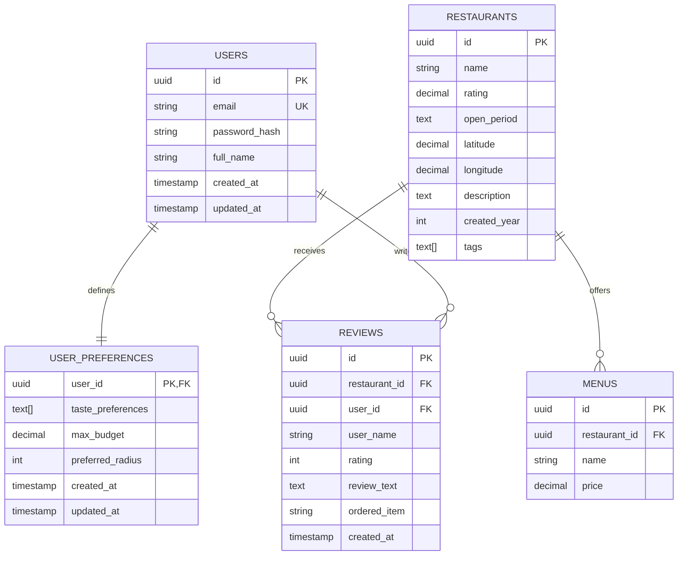

# Foodiction Database Schema Design

**Project:** Food Recommendation Web Application (Yogyakarta Culinary Heritage Platform)  
**Type:** University Capstone Project / Scalable Software Design Implementation  
**Target Architecture:** Monolithic Database / Single Node (Stateless API)  
**Engines:** PostgreSQL 14+ (Handles both User & Food Domains)  

---

## Table of Contents
1. [Entity Relationship Diagram (ERD)](#1-entity-relationship-diagram-erd)
2. [Database Schema (PostgreSQL)](#2-database-schema-postgresql)
3. [Data Dictionary & Constraints](#3-data-dictionary--constraints)
4. [Query Optimization & Indexing Strategy](#4-query-optimization--indexing-strategy)

---

## 1. Entity Relationship Diagram (ERD)

The system manages both user data (auth/preferences) and food catalog data within a single PostgreSQL database (`foodiction_db`) to simplify foreign keys and optimize geospatial joins.



---

## 2. Database Schema (PostgreSQL)

This document describes the current schema design for the application.
The authoritative source for the actual database structure is the migration files inside the `BE/migrations/` folder.

```sql
-- Enable generation extension for high-performance UUID keys
CREATE EXTENSION IF NOT EXISTS "uuid-ossp";

-- 1. Users Table
CREATE TABLE users (
    id UUID PRIMARY KEY DEFAULT uuid_generate_v4(),
    email VARCHAR(255) UNIQUE NOT NULL,
    password_hash VARCHAR(255) NOT NULL,
    full_name VARCHAR(255) NOT NULL,
    created_at TIMESTAMP WITH TIME ZONE DEFAULT CURRENT_TIMESTAMP,
    updated_at TIMESTAMP WITH TIME ZONE DEFAULT CURRENT_TIMESTAMP
);

-- 2. User Preferences Table (Drives personalized recommendation limits)
CREATE TABLE user_preferences (
    user_id UUID PRIMARY KEY REFERENCES users(id) ON DELETE CASCADE,
    taste_preferences TEXT[],
    max_budget NUMERIC(10,2),
    preferred_radius INTEGER,
    created_at TIMESTAMP WITH TIME ZONE DEFAULT CURRENT_TIMESTAMP,
    updated_at TIMESTAMP WITH TIME ZONE DEFAULT CURRENT_TIMESTAMP
);

-- 3. Restaurants Table
CREATE TABLE restaurants (
    id UUID PRIMARY KEY,
    name VARCHAR(255) NOT NULL,
    description TEXT,
    rating NUMERIC(3,2),
    open_period TEXT,
    created_year INTEGER,
    tags TEXT[],
    latitude NUMERIC(10,8),
    longitude NUMERIC(11,8)
);

-- 4. Menus Table
CREATE TABLE menus (
    id UUID PRIMARY KEY DEFAULT uuid_generate_v4(),
    restaurant_id UUID NOT NULL REFERENCES restaurants(id) ON DELETE CASCADE,
    name VARCHAR(255) NOT NULL,
    price NUMERIC(10,2) NOT NULL
);

-- 5. Reviews Table
CREATE TABLE reviews (
    id UUID PRIMARY KEY DEFAULT uuid_generate_v4(),
    restaurant_id UUID NOT NULL REFERENCES restaurants(id) ON DELETE CASCADE,
    user_id UUID REFERENCES users(id) ON DELETE SET NULL,
    user_name VARCHAR(100),
    rating INTEGER,
    review_text TEXT,
    ordered_item VARCHAR(255),
    created_at TIMESTAMP WITH TIME ZONE DEFAULT CURRENT_TIMESTAMP
);
```

---

## 3. Data Dictionary & Constraints

### Restaurants Table Field Notes
* `rating`: Stored as `NUMERIC(3,2)` to preserve fractional averages while limiting scale.
* `open_period`: A normalized text field representing availability windows such as `"weekday lunch"`, `"weekend dinner"`, or `"24/7"`.
* `tags`: Stored as a PostgreSQL text array (`TEXT[]`), useful for cuisine categories and feature labels.
* `description`: Free-text restaurant description populated from merchant metadata.
* `created_year`: The restaurant launch year extracted from merchant `createTime` data.

### Menus Table Field Notes
* `name`: Cleaned menu item name after removing location/place suffixes from source CSV values.
* `price`: Stored as `NUMERIC(10,2)` to support currency accuracy without float drift.

### User Preferences Table Field Notes
* `taste_preferences`: Stored as a PostgreSQL text array (`TEXT[]`) containing taste profile keywords (e.g., `['spicy', 'savory']`).
* `max_budget`: The user's maximum acceptable price for an item, used directly to filter out expensive restaurants.
* `preferred_radius`: Distance in meters (e.g., `5000` for 5km) to limit the Haversine distance search.

---

## 4. Query Optimization & Indexing Strategy

To maintain a responsive interface under peak loads of up to 250 RPS, indexes are placed on fields targeted by sorting, mathematical functions, or heavy multi-table joins.

### PostgreSQL Indexing Implementations
```sql
-- 1. Optimize Geospatial Distance Queries
-- Accelerates coordinate bounding box queries for nearby calculation equations
CREATE INDEX idx_restaurants_coords ON restaurants (latitude, longitude);

-- 2. Optimize Menu Joins
-- Speeds up join operations when retrieving menus for a restaurant
CREATE INDEX idx_menus_restaurant ON menus (restaurant_id);

-- 3. Optimize Auth Queries
-- Speeds up login process by quickly searching user email
CREATE INDEX idx_users_email ON users (email);

-- 4. Optimize Recommendation Queries (Collaborative Filtering)
-- Speeds up finding all reviews written by a specific user
CREATE INDEX idx_reviews_user ON reviews (user_id);
```
